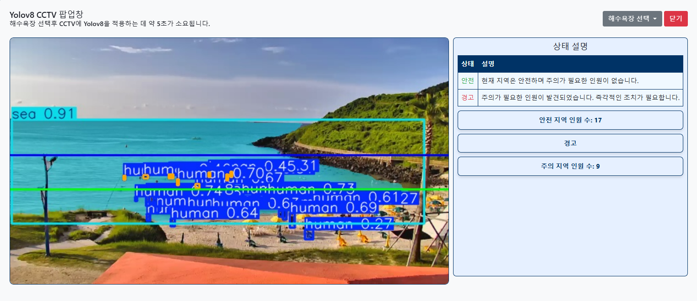
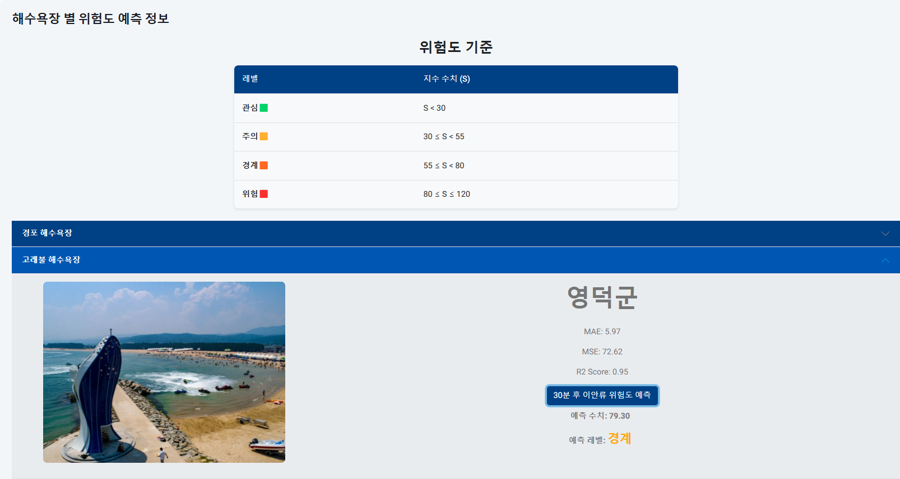
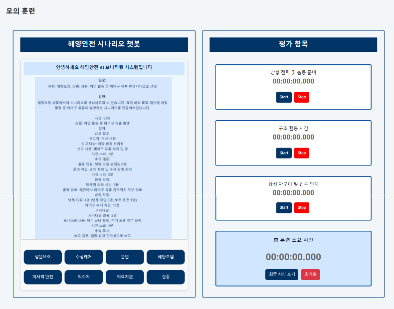
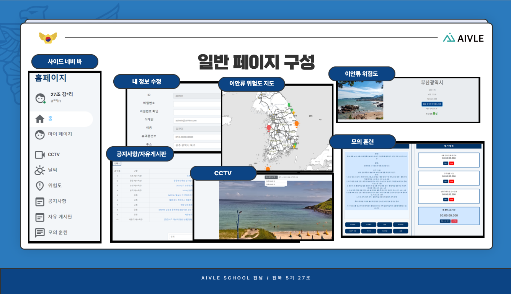
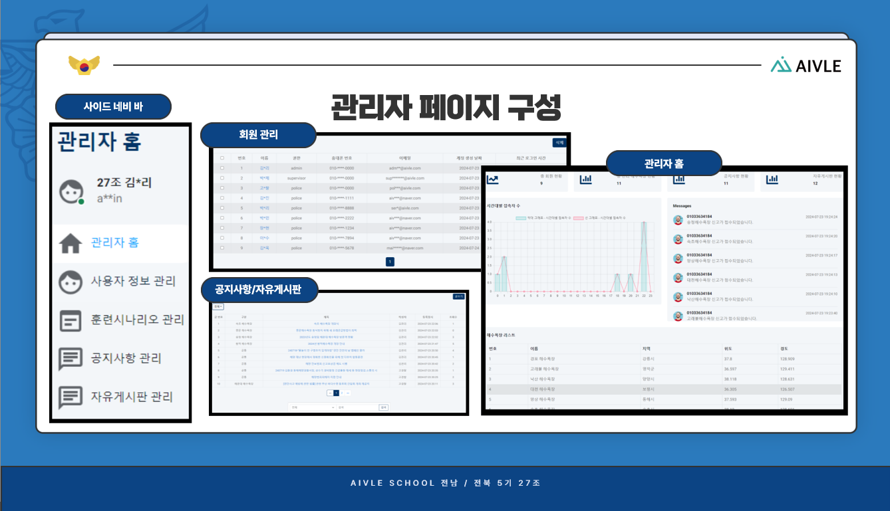
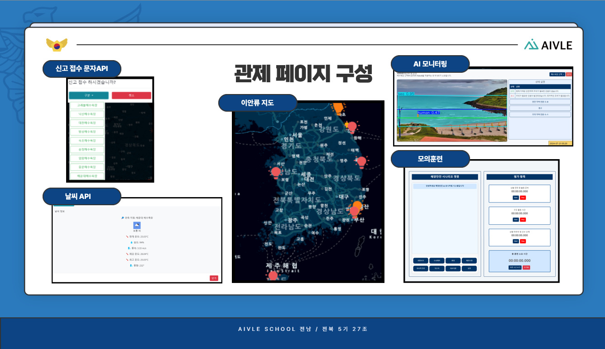
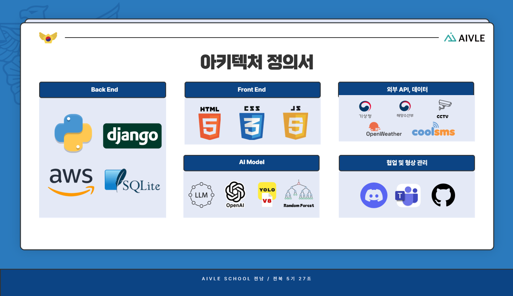

# :ocean: 해양 안전 AI 모니터링 시스템 
 ### :curly_loop: KT AIVLE 5기 - AI Track 27조


## 🕰️ 개발 기간
* 2024.06 - 2024.08 (7주)

## :pushpin: 서비스 소개
해양 안전 AI 모니터링 시스템은 이안류와 해수욕장 경계선, 인원 판별 기능을 통해 해수욕장에서 발생할 수 있는 인명 피해를 최소화하는 관제 및 웹 페이지 서비스입니다. 이 시스템은 최첨단 AI 기술을 활용하여, 해양경찰과의 연계를 통해 신속하고 정확한 대응을 가능하게 합니다.

- YOLO 기반 AI CCTV: 실시간으로 해수욕장 상황을 모니터링하여 위험 요소를 빠르게 감지하고, 이안류 발생 시 즉각적인 경고를 제공합니다.

- 챗봇을 통한 모의훈련 시나리오: 해양경찰에게 다양한 시나리오를 제공해 실전과 같은 훈련을 지원하며, 비상 상황에서도 신속한 대응 능력을 강화합니다.

- 랜덤포레스트 기반 이안류 예측: 30분 뒤의 이안류 지수를 정확하게 예측하여 선제적으로 대응할 수 있도록 도와줍니다.

이 시스템을 통해 해양 안전을 더욱 강화하고, 국민이 안심하고 바다를 즐길 수 있는 환경을 조성합니다.
 

 ## 📝구동 가이드

```
pip install -r requirements.txt
python manage.py runserver
```

## :pushpin: 주요 기능

* YOLOv8 을 이용한 실시간 해수욕장 모니터링
  
    - 실시간 object detection 가능
    - 수영 경계 안전선 기준으로 안전 지역과 주의 지역 인원을 비동기로 실시간 업데이트

* 이안류 위험도 실시간 예측
  
    - 이안류 위험도 지수 기준으로 레벨 분류
    - 실시간 이안류 위험지수를 통해 현재시각으로부터 30분 후 위험도 예측
    - 예측 레벨에 따른 색상 변화

* 챗봇을 이용한 안전 사고 예방 훈련 시나리오
  
    - 모의훈련 생성형 ai 유형 별 버튼식 챗봇
    - 훈련 상황 별 시간 기록 및 총 훈련 소요시간 저장


## :pushpin: 그 외 서비스




* 회원가입, 로그인/로그아웃, 비밀번호 찾기
* 개인 정보 조회 및 변경
* 회원 조회 및 삭제
* 실시간 해수욕장 날씨 조회
* 실시간 해수욕장 CCTV 조회
* 문자 발신을 이용한 신고 서비스
* 공지사항/자유게시판 작성 및 파일 업로드 
* 챗봇 서비스를 위한 훈련 데이터 CSV 업로드
* 게시글 조회 및 삭제
* 실시간 이안류 위험도 조회
* 접속자 현황 조회
* 신고 현황 조회


## 🔧기술 스택


AI Model
<br>
 
 
 
<div>
Back End
<br>


<br>


<br>
<br>
Front End
<br>
 
 
 
</br>
<br>


협업 및 형상관리
<br>


</br>
<br>
<br>
</div>


## 🥇프로젝트 담당 역할

| 성명                                      | 역할                                                                                                                                                                                      |
| ----------------------------------------- | ----------------------------------------------------------------------------------------------------------------------------------------------------------------------------------------- |
| [범종원](https://github.com/Beomjw)    | $\cdot$ Product Manager <br/> $\cdot$ 도로 파손 탐지(모델 설계, 모델 고도화), 홍수 예측(모델 설계, 데이터 전처리), 챗봇(모델 설계) <br/> $\cdot$ Backend(도로 파손 탐지, 홍수 예측, 챗봇) |
| [고도영](https://github.com/DoYoung5)  | $\cdot$ 홍수 예측(모델 고도화), 침수 지역 예측(모델 설계, 데이터 전처리), 챗봇(모델 고도화) <br/> $\cdot$ Frontend(홍수 예측, 침수 지역 예측, 챗봇)                                       |
| [김상호](https://github.com/k2lly)       | $\cdot$ 침수 지역 예측(데이터 전처리), 챗봇(데이터 전처리), 도로 파손 탐지(모델 설계), <br/> $\cdot$ Frontend(침수 지역 예측, 챗봇, 도로 파손 탐지)                                       |
| [김서현](https://github.com/seohyeon07)     | $\cdot$ 홍수 예측 (모델 고도화), 침수 지역 예측(AI 모델 설계, 데이터 전처리), 챗봇(모델 설계, 데이터 전처리) <br/> $\cdot$ Frontend(홍수 예측, 침수 지역 예측, 챗봇)                      |
| [김은옥](https://github.com/lpaead)      | $\cdot$ Frontend(Login/Signup, MyPage) <br/> $\cdot$ Backend(과거침수 지역, 대피소, 강수량) <br/> $\cdot$ Design                                                                          |
| [김하진](https://github.com/ktaivlehj)       | $\cdot$ Frontend(NavBar, Notice, 도로 파손 탐지) <br/> $\cdot$ Design                                                                                                                     |
| [박세리](https://github.com/kong68)    | $\cdot$ Backend(Notice/User Data CRUD, SignIn, MyPage) <br/> $\cdot$ DBA <br/> $\cdot$ Design                                                                                             |
| [이대환](https://github.com/leeeedaehwan) | $\cdot$ Frontend(구별 하천 수위) <br/> $\cdot$ Backend(구별 하천 수위)   <br/> $\cdot$ Code Convention                                                                                 |
| [임태경](https://github.com/tklim99)   | $\cdot$ Backend(구별 하천 수위, 챗봇, Login/Signin, 아이디/비밀번호 찾기, MainPage) <br/> $\cdot$ Frontend(MainPage)                                                                      |